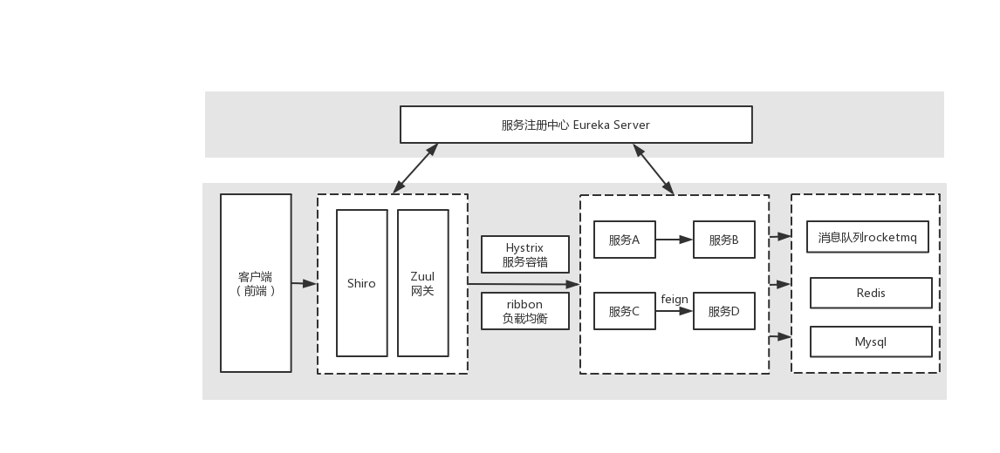
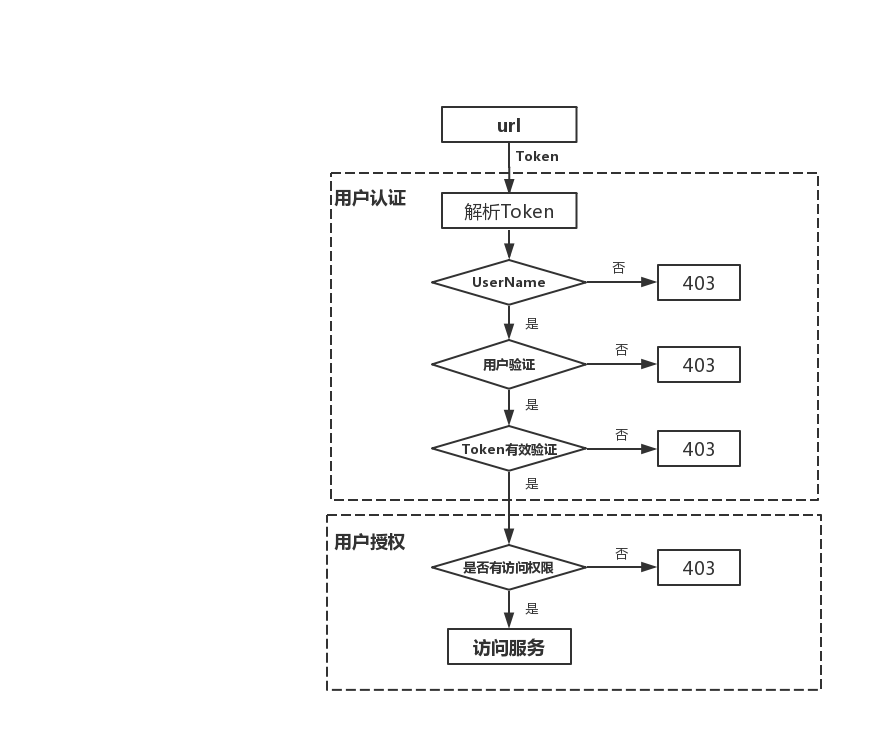
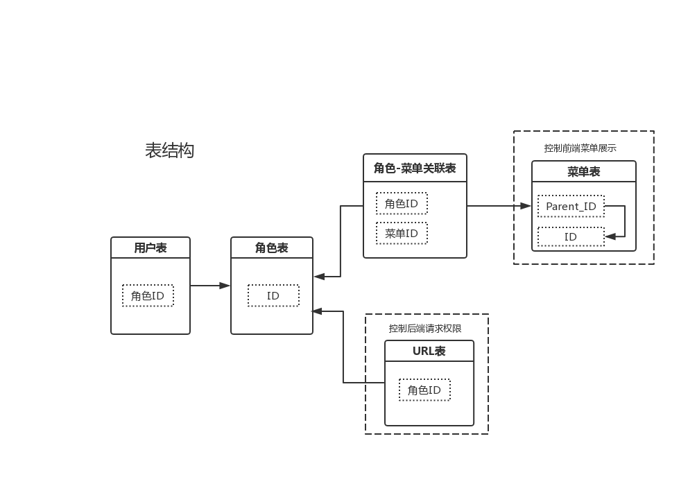

#基于spring cloud的分布式应用开发平台
##1. 开发环境
* jdk1.8
* maven
> maven下载地址：https://maven.apache.org/download.cgi

> maven安装环境配置：https://www.jianshu.com/p/183d4f229103
##2. 平台用到的技术
* eureka(注册中心)
* zuul(网关)
* shiro(用户认证与授权)
* spring boot(微服务)
* feign(http客户端)
* redis(缓存)
* rocketmq(消息中间件)
* spring jpa(持久层)

###2.1 eureka注册中心
neusipo-center 负责服务的注册与发现
* pom配置eureka-server包即可，[maven依赖](../neusipo-center/pom.xml "maven依赖")
* [配置文件](../neusipo-center/src/main/resources/application.properties "eureka配置文件")
* 启动类配置@EnableEurekaServer,@SpringBootApplication注解。[启动类配置](../neusipo-center/src/main/java/com/neusoft/neusipo/CenterBoot.java "启动类配置")
###2.2 zuul网关
neusipo-gateway 负责将外部请求转发到具体微服务上
* pom配置eureka-client,zuul包，[maven依赖](../neusipo-gateway/pom.xml "maven依赖")
* [配置文件](../neusipo-gateway/src/main/resources/application.properties "zuul配置文件")
* 启动类配置@SpringBootApplication,@EnableZuulProxy注解。[启动类配置](../neusipo-gateway/src/main/java/com/neusoft/neusipo/GatewayBoot.java)
###2.3 shiro用户认证与授权
shiro集成到了neusipo-gateway项目上，对每个进入到网关的请求进行用户认证和授权，具体流程如下：

相关的类在neusipo-gateway项目com.neusoft.neusipo.gateway.shiro包和[ShiroConfig类](../neusipo-gateway/src/main/java/com/neusoft/neusipo/gateway/config/ShiroConfig.java)

所涉及的权限表如图所示：

权限相关业务放到neusipo-admin项目。
###2.4 spring boot微服务
**以neusipo-admin项目为例**

* pom配置eureka-client,spring-boot-starter-web。[maven依赖](../neusipo-admin/pom.xml)
* 开发分3层结构repository(dao),service(bs),controller(action)
* entity包下存放数据库映射实体类，配置表名、字段、主键、外键等。需要继承BaseEntity类
* repository包下存放数据库查询接口，需要继承BaseRepository，[查询规则]()
* service包下存放业务接口和实现，业务接口需要继承BaseService，业务接口实现类需要继承BaseServiceSupport(提供增删改查方法)
* 使用@Execution注解配置日志代码和异常代码。[UserServiceImpl](../neusipo-admin/src/main/java/com/neusoft/neusipo/admin/service/impl/UserServiceImpl.java)，日志代码和异常代码配置在error-code.properties和log-code.properties
* controller包下存放控制器，需要继承BaseController(提供增删改查restful接口)
* 控制器返回数据统一处理([ControllerResponseAdvice类](../neusipo-core/src/main/java/com/neusoft/neusipo/core/advice/ControllerResponseAdvice.java))，统一封装成[Response](../neusipo-core/src/main/java/com/neusoft/neusipo/core/base/Response.java)对象([状态码](../neusipo-core/src/main/resources/status-code.properties))
* 统一异常处理([ControllerExceptionAdvice](../neusipo-core/src/main/java/com/neusoft/neusipo/core/advice/ControllerExceptionAdvice.java))，返回异常代码对应的异常信息
###2.5 feign http客户端

是声明式的http客户端，可以实现服务间接口的调用。

参考例子neusipo-gateway项目里调用neusipo-feign项目的接口。[AuthClient](../neusipo-gateway/src/main/java/com/neusoft/neusipo/gateway/feign/AuthClient.java)
* pom配置feign包，[maven依赖](../neusipo-gateway/pom.xml "maven依赖")
* 启动类配置@EnableFeignClients注解
###2.6 redis 缓存
* pom配置spring-boot-starter-data-redis
* [redis配置类](../neusipo-core/src/main/java/com/neusoft/neusipo/core/config/RedisConfig.java)
* [redis操作类](../neusipo-core/src/main/java/com/neusoft/neusipo/core/redis/RedisRepository.java)
* [redis配置文件](../neusipo-admin/src/main/resources/application.properties)
* 开启缓存管理使用@EnableCaching注解，这样可以在方法上使用@Cacheable等注解进行缓存 [例子](https://blog.csdn.net/Dreamhai/article/details/80642010) TODO
###2.7 rocketmq 消息中间件
* pom配置rocketmq-client包
* [生产者配置文件](../neusipo-admin/src/main/resources/application.properties)
* 生产者需要继承AbstractMQProducer，加上@Component注解 [CustomMQProducer](../neusipo-admin/src/main/java/com/neusoft/neusipo/admin/message/rocketmq/CustomMQProducer.java)
* 发送消息两种方式：使用@SendMessage,自动注入DefaultProducer接口实现，调用asyncSend方法  TODO
* [消费者配置文件](../neusipo-gateway/src/main/resources/application.properties)
* 消费者需要继承AbstractMQConsumer，加上@Component注解, 重写init方法，方法里设置topic并需要调用父类init方法。实现consume方法消费消息。[UpdateFilterMapConsumer](../neusipo-gateway/src/main/java/com/neusoft/neusipo/gateway/message/rocketmq/UpdateFilterMapConsumer.java)
###2.8 spring jpa
参考例子neusipo-admin
* pom配置spring-boot-starter-data-jpa包
* [对象关系映射配置](../neusipo-admin/src/main/java/com/neusoft/neusipo/admin/entity/User.java)
* [方法命名规则](https://blog.csdn.net/china_3/article/details/81456735)

